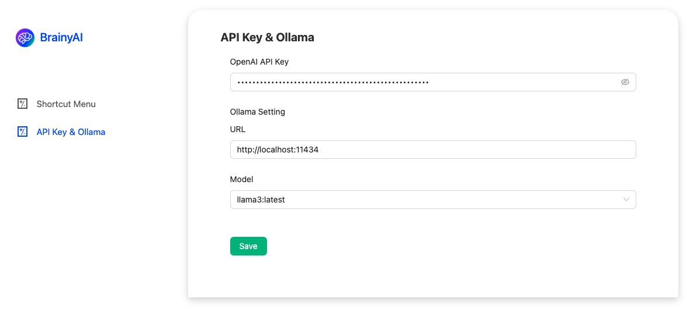
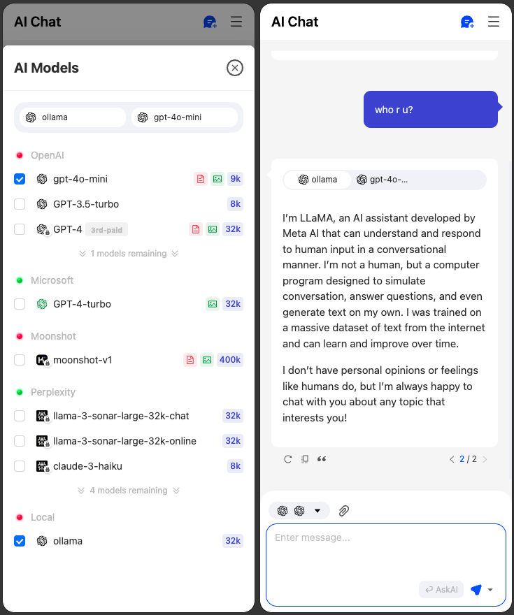
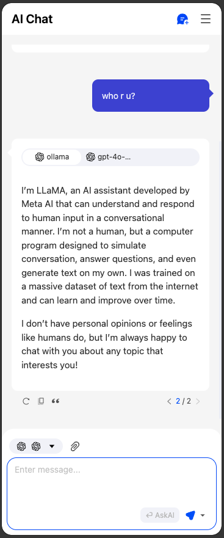

# BrainyAI

Based on BrainAI project, modified API calls to be API Key based (gpt-4o-mini) and support local llm [Ollama](https://ollama.com).

## Setting



 



## For developers

### Getting started

First, install the dependencies:

```bash
npm install pnpm -g
```

```bash
pnpm install
```

Then, start the development server:

```bash
pnpm dev
```

Open your browser and load the appropriate development build. For example, if you are developing for the chrome browser, using manifest v3, use: `build/chrome-mv3-dev`.

For further guidance, [visit plasmo Documentation](https://docs.plasmo.com/)

### Vscode debug launch file

```json
{
    "version": "0.2.0",
    "configurations": [
        {
            "name": "Launch debug",
            "type": "chrome",
            "request": "launch",
            "url": "http://localhost:3000",
            "timeout": 10000,
            "runtimeArgs": ["--load-extension=${workspaceFolder}/build/chrome-mv3-dev"]
        },
        {
            "name": "Attach debug",
            "type": "chrome",
            "request": "attach",
            "url": "http://localhost:3000",
            "port": 9222,
            "webRoot": "${workspaceFolder}/build/chrome-mv3-dev"
        }
    ]
}
```

### Making production build

Run the following:

```bash
pnpm build
```

This should create a production bundle for your extension, ready to be zipped and published to the stores.

### Making production(debug) build, which will reserve the logs

Run the following:

```bash
pnpm build:staing
```


