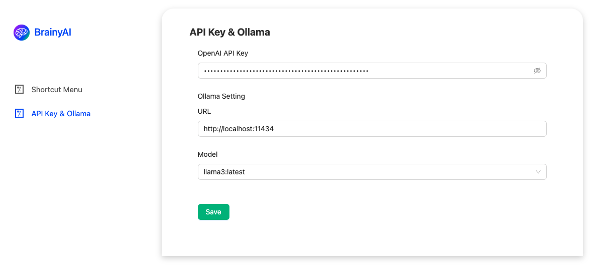
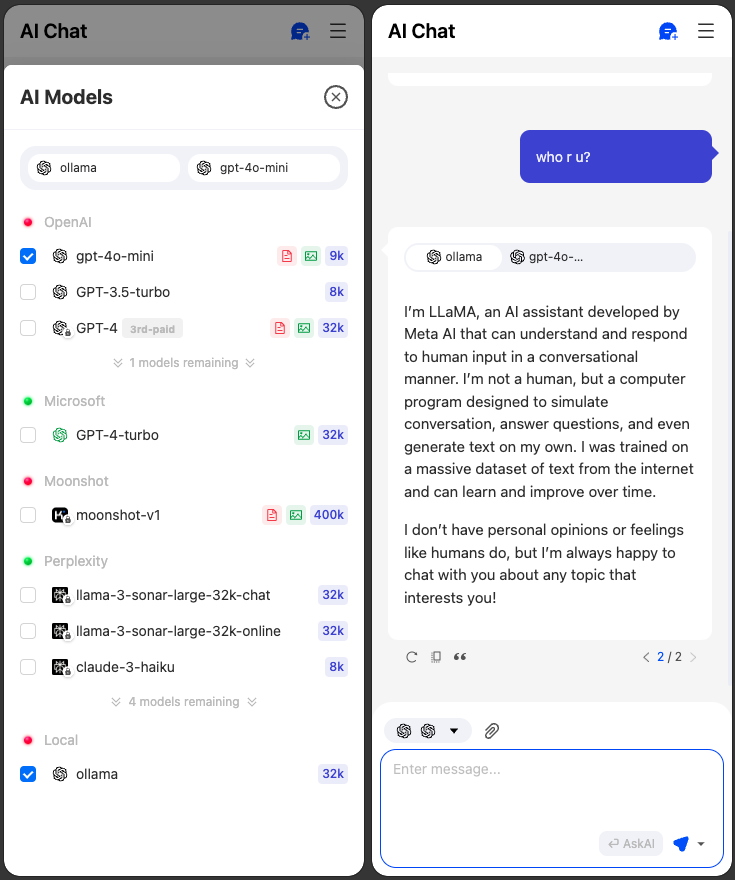

# BrainyAI

Based on BrainAI project, modified API calls to be API Key based and support local llm [Ollama](https://ollama.com).

Supported API providers (set the key and model in **Options → API Keys & Models**):

- OpenAI (default model `gpt-5-mini`)
- Google Gemini (default model `gemini-flash-latest`, an alias Google moves to each new Flash release)
- DeepSeek (default model `deepseek-v4-flash`)
- Moonshot Kimi (default model `kimi-k3`; set the base URL to `https://api.moonshot.cn/v1` for China-platform keys)
- Custom: any OpenAI-compatible API (OpenRouter, Groq, Mistral, xAI, LM Studio, ...) by base URL
- Ollama (local)

The original website-login models (ChatGPT web, Microsoft Copilot, Kimi web, Perplexity Labs) are no longer
shown: those sites changed their private APIs and the listed models were retired. Use the official APIs above instead.

### Selection toolbar

The toolbar that appears when you select text adapts to where the text is:

- **Page text** (paragraphs, headings, ...): reading actions: Search, Translate, Summarize, Explain, Key points.
- **Text fields** (inputs, textareas, rich-text editors): writing actions: Translate, Improve writing, Rephrase,
  Grammar check, plus Make shorter and Professional tone in the dropdown. Password fields are ignored.

Choose and order the actions in **Options → Prompt Manager**. It has a tab per place prompts are offered:

| Tab | Where |
|---|---|
| **Chat/Ask** | the Ask box (⌘/Ctrl+J) and the side panel chat |
| **Reading Assistant** | the toolbar on selected page text |
| **Writing Assistant** | the toolbar on text selected in a text field |

Each tab has a **Show on the list** column (drag to reorder) and an **Archive** column (drag prompts there, or use the
archive button, to hide them in that tab only). The first prompts are buttons and the others are in the dropdown; how many
are buttons is set per tab (0–8, default 4, or 6 in Chat/Ask). **New Prompt** adds a prompt to the current tab and archives it in the others.

### Turning BrainyAI off on a website

Hover the selection quick bar and click the small × at its top-right corner, then choose from the menu that opens beside it:
**Disable on this website** or **Disable on all websites**. On a disabled site BrainyAI shows nothing on the page
(no quick bar, no page buttons, no ⌘/Ctrl+J ask box); the side panel still opens from the toolbar or ⌘/Ctrl+I.
Turn it back on in **Options → Websites**, where you can also add or remove sites.

### New model releases

You don't need to update the extension when a provider releases a model:

- The Model field lists the models your key can use, loaded live from the provider's `GET /models`
  (refreshed every time the settings page opens), with the recommended one marked.
- Leaving the Model field empty uses the provider's default, which is a "latest" alias where one exists.
- If the saved model is retired, the next chat request detects it, switches to the recommended model
  from the live list, and saves it.

### Adding another provider

Any provider that implements the OpenAI Chat Completions API only needs a new entry in
`API_PROVIDERS` in [`libs/chatbot/api/providers.ts`](libs/chatbot/api/providers.ts). The settings page and the
model picker are generated from that list.

## Setting



 

## For developers

### Getting started

First, install the dependencies:

```bash
npm install pnpm -g
```

```bash
pnpm install
```

Then, start the development server:

```bash
pnpm dev
```

Open your browser and load the appropriate development build. For example, if you are developing for the chrome browser, using manifest v3, use: `build/chrome-mv3-dev`.

For further guidance, [visit plasmo Documentation](https://docs.plasmo.com/)

### Vscode debug launch file

```json
{
    "version": "0.2.0",
    "configurations": [
        {
            "name": "Launch debug",
            "type": "chrome",
            "request": "launch",
            "url": "http://localhost:3000",
            "timeout": 10000,
            "runtimeArgs": ["--load-extension=${workspaceFolder}/build/chrome-mv3-dev"]
        },
        {
            "name": "Attach debug",
            "type": "chrome",
            "request": "attach",
            "url": "http://localhost:3000",
            "port": 9222,
            "webRoot": "${workspaceFolder}/build/chrome-mv3-dev"
        }
    ]
}
```

### Ollama setting
If there is 403 error happen, let start Ollama with option: `OLLAMA_ORIGINS=* ollama serve`

### Making production build

Run the following:

```bash
pnpm build
```

This should create a production bundle for your extension, ready to be zipped and published to the stores.

### Making production(debug) build, which will reserve the logs

Run the following:

```bash
pnpm build:staing
```


